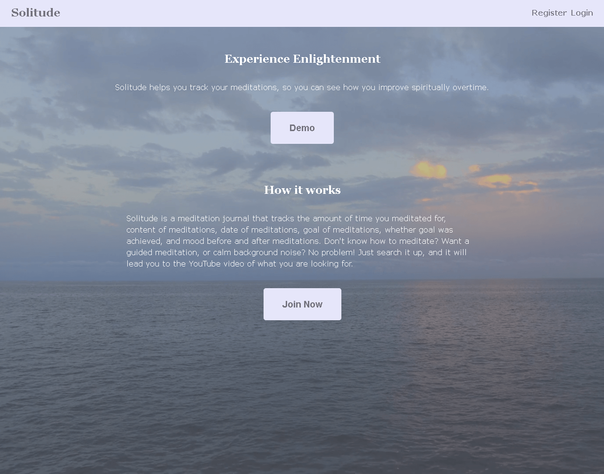

# Solitude 

**link to app:** 
https://solitude-app.now.sh/

**API Documentation:** 
https://github.com/ewang10/solitude-api

**Description:**
Solitude is a meditation journal application. It allows users to keep track of the 
duration, moods, goal, and content of their meditation. If needed, users can also
search up videos to help with their meditation such as guided meditation or a
calm background sound like waterfall or rainfall. In order to use the functionality 
of the app, users need to register for an account and login.

**Techonologies used:**
HTML/CSS/JavaScript/Node/Express/React/JSX/Knex/PostgreSQL

Favicon made by Pixel Buddha from www.flaticon.com
